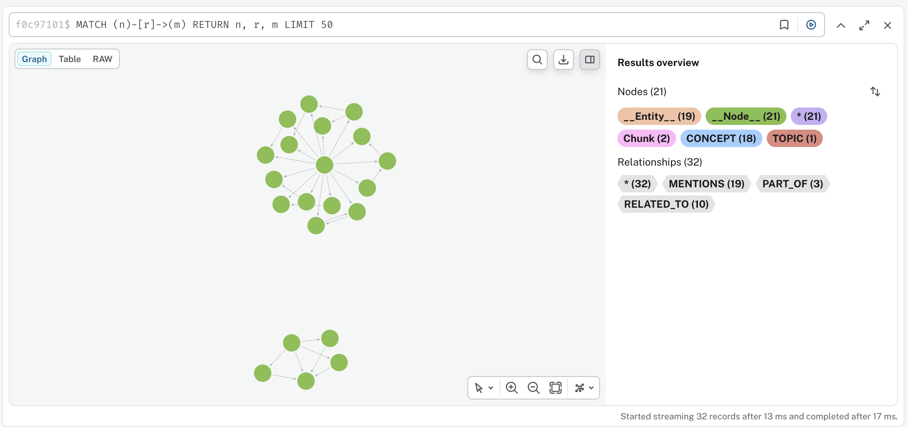

# SMARTEST O2 — Knowledge Graph Pipeline

## Overview
This repository contains the implementation of the O2 pipeline for the 
"AI for Better Learning" project at the University of Westminster.

The pipeline automatically extracts knowledge graphs from teaching materials
using local LLMs (no paid API required) and stores them in Neo4j AuraDB.

## Tech Stack
- LlamaIndex PropertyGraphIndex — pipeline orchestration
- Ollama + Llama-3 8B — local LLM (free, no API cost)
- HuggingFace embeddings — local embeddings (free)
- Neo4j AuraDB — graph database
- pdfplumber — PDF text extraction

## Pipeline Steps
1. Load credentials securely from .env
2. Verify Neo4j AuraDB connection
3. Test local Ollama LLM
4. Extract text from PDF lecture materials
5. Load all documents into LlamaIndex
6. Set up extraction schema and pipeline components
7. Build knowledge graph and persist to Neo4j AuraDB
8. Verify graph in AuraDB and visualise
9. Query graph using natural language

## Setup Instructions

### 1. Clone the repository
git clone https://github.com/yourusername/smartest-o2-pipeline

### 2. Create virtual environment
conda create -n smartest_o2 python=3.11
conda activate smartest_o2
pip install -r requirements.txt

### 3. Install Ollama
Download from https://ollama.com
Then run: ollama pull llama3:8b

### 4. Create .env file
Create a file called .env in the project root:
NEO4J_URI=your-uri-here
NEO4J_USERNAME=your-username-here
NEO4J_PASSWORD=your-password-here
NEO4J_DATABASE=your-database-here

### 5. Add data files
Place Maths for Computing PDF materials in the data/ folder

### 6. Run the notebook
Open 01_neo4j_connection_test.ipynb and run all cells

## Current Status
- Pipeline tested on Lecture 1 (MathsComp_Lecture1.pdf)
- 25 nodes and 32 relationships extracted and stored in AuraDB
- Natural language querying working end to end

## Next Steps
- Process all 24 lecture documents
- Extend schema based on O4 ontology work
- Connect to SMARTEST MongoDB