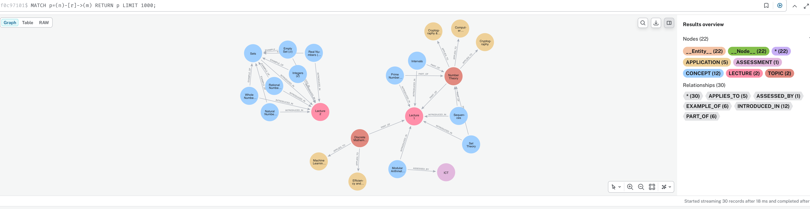

# SMARTEST O2 — Knowledge Graph Pipeline

## Overview
This repository contains the implementation of the O2 pipeline for the
"AI for Better Learning" project at the University of Westminster.

The pipeline automatically extracts knowledge graphs from academic lecture
materials using local LLMs (no paid API required) and stores them in
Neo4j AuraDB for graph-based navigation and querying.

## Tech Stack
- LlamaIndex PropertyGraphIndex — pipeline orchestration
- Ollama + Llama-3 8B — local LLM (free, no API cost)
- HuggingFace BAAI/bge-small-en-v1.5 — local embeddings (free)
- Neo4j AuraDB — cloud graph database
- pdfplumber — PDF text extraction
- python-docx — DOCX text extraction

## Pipeline Steps
1. Load credentials securely from .env
2. Verify Neo4j AuraDB connection
3. Test local Ollama LLM
4. Define text extraction functions (PDF and DOCX)
5. Check which documents are already processed in AuraDB
6. Scan data folder and identify new documents
7. Set up pipeline: preprocessing, schema, LLM extractor
8. Connect to existing AuraDB graph or initialise fresh index
9. Process new documents: extract, preprocess, insert, clean up
10. Verify final graph state in AuraDB
11. Set up natural language query engine
12. Query the graph using natural language

## Extraction Schema
**Entity types:** CONCEPT, TOPIC, LECTURE, APPLICATION, ASSESSMENT

**Relationship types:** INTRODUCED_IN, PART_OF, APPLIES_TO, DEFINED_BY,
PREREQUISITE_OF, USED_IN, EXAMPLE_OF, ASSESSED_BY

## Setup Instructions

### 1. Clone the repository
git clone https://github.com/Alexipsc/smartest-o2-pipeline

### 2. Create virtual environment
conda create -n smartest_o2 python=3.11
conda activate smartest_o2
pip install -r requirements.txt

### 3. Install Ollama
Download from https://ollama.com then run:
ollama pull llama3:8b

### 4. Create .env file
Create a file called `.env` in the project root:
NEO4J_URI=your-uri-here
NEO4J_USERNAME=your-instance-id-here
NEO4J_PASSWORD=your-password-here
NEO4J_DATABASE=your-database-here

Note: for AuraDB the username is your instance ID, not "neo4j".

### 5. Add data files
Place lecture PDF and DOCX materials in the `data/` folder.
To process only specific files, update the `TEST_FILES` list in Step 6.

### 6. Run the notebook
Open `01_neo4j_connection_test.ipynb` and run all cells in order.

## Current Status
- Pipeline tested on Lectures 1 and 2 (Maths for Computing, 4COSC002W)
- 22 nodes and 30 relationships extracted across both lectures
- Both LECTURE nodes correctly attributed via INTRODUCED_IN relationships
- Preprocessing filters navigational slides and noise content
- Natural language querying working end to end

## Known Limitations
- Concept coverage is constrained by Llama 3 8B's extraction reliability
- PREREQUISITE_OF and USED_IN relationships are not yet being extracted
- The TOPIC allowlist in the extraction prompt is specific to this module
  and must be reviewed before applying the pipeline to a different module

## Next Steps
- Process remaining 22 lecture documents
- Improve concept coverage through prompt refinement or a larger LLM
- Finalise schema jointly with O4 team once ontology work matures
- Integrate with SMARTEST platform (scoped as future work)